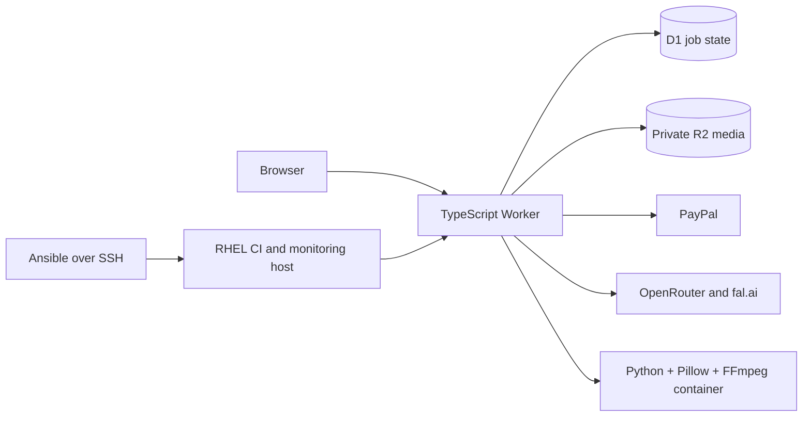

# Talember

[](https://github.com/Ralex48/talember-open/actions/workflows/ci.yml)

An open-source photo-to-video application. Turn photos and a story into a short
animated video, review its script before generation, then place the greeting,
hearts and fireworks yourself before downloading the finished MP4.

This repository contains the working TypeScript application, Python video
compositor, Go monitoring probe and Ansible operations playbook. Production
credentials, customer media and private repository history are excluded.

## What it does

- Cartoon and Realism image styles, with one generated reference per source photo.
- Server-verified PayPal capture before paid creative work.
- Editable video script with explicit generation approval.
- Durable job state, private media storage and bounded recovery of failed work.
- Deterministic multilingual greetings instead of model-generated lettering.
- Live placement of the greeting, individual hearts, fireworks and supported emoji.
- English, Spanish, Russian and Hebrew interfaces.

## Architecture



Cloudflare serves production requests. RHEL supports private release automation
and monitoring. The public repository uses GitHub-hosted CI; it has no connection
to the production runner or deployment credentials.

| Language/tool | Responsibility |
| --- | --- |
| TypeScript | Browser UI, API, payments and durable orchestration |
| Python | Typography, bidirectional text, deterministic MP4 compositing and publication audit |
| Go | Bounded public-page probes, JSON health and Prometheus metrics |
| Ansible | Repeatable RHEL packages, optional Node/runner setup and monitoring deployment |
| GitHub Actions + RHEL 9 | Production CI/CD: verification, Cloudflare deployment and post-deployment checks |
| SQL | Job state, receipts, retention and recovery records |

## CI/CD in practice

Production uses GitHub Actions with a self-hosted RHEL 9 runner. A push to the
private repository's main branch runs verification; a successful run enables
deployment when the production CD switch is active. The release deploys the
renderer and application to Cloudflare, then checks public-page availability.
Database migrations remain a separate reviewed operation.

This public repository runs application, renderer and operations checks on
GitHub-hosted runners. The CI badge above describes those public checks. Production
deployment credentials and runner access stay in the private environment.

See [the CI/CD walkthrough](docs/CI_CD.md) for the release diagram, tool roles,
failure behavior and exercises for reproducing the setup in your own environment.

## Run locally

Use Node24/npm11. Docker is needed for compositor tests. Go1.24+ and Python3
are needed for the optional operations tools.

```sh
npm ci
npm run typecheck
npm run lint
npm test
npm run db:local
npm run dev
```

The checked-in configuration disables creation and uses placeholders. This opens
the interface without performing real payments or generation. To explore the
simulated journey, run `node scripts/preview-service.mjs --synthetic`; providers
are local fakes and the synthetic PayPal redirect is a test fixture, not a real
checkout. See [development](docs/DEVELOPMENT.md) for the test boundaries.

```sh
docker build --target test -t talember-renderer-test renderer
docker run --rm --network none talember-renderer-test python3 -m unittest test_renderer
cd ops/probe && go test -race ./...
```

## Deploy your own instance

Follow [deployment](docs/DEPLOYMENT.md) for Cloudflare resources, configuration,
provider secrets and activation. [Operations](ops/README.md) covers RHEL/Ansible
and Go monitoring. Deployment is opt-in and is never triggered by public CI.

The public demo pictures are labeled SVG placeholders and the demo video is a
synthetic fixture. Supply your own licensed demo assets before launching a site.

## Monitoring roadmap

**Implemented:** a Go public-page probe exposes JSON health and Prometheus-compatible
metrics; Ansible deploys the probe to the RHEL operations host.

**Planned:** Prometheus for metric collection and retention, Grafana dashboards
and alert rules, and Ansible provisioning of the monitoring stack. These components
are not yet deployed or validated as part of this project. The planned dashboards
will distinguish exporter availability, page-check results, stale measurements and
page latency. An independent external check is also planned to detect monitoring-host
outages.

This work will provide practical exercises in Linux operations, networking,
observability and infrastructure automation alongside the existing
[CI/CD learning path](docs/CI_CD.md).

## Practical limits

Image/video generation is probabilistic: likeness, spatial continuity and object
permanence are not guaranteed. Reference-preservation prompts cannot guarantee
physical correctness. The placement preview shows finished typography, not every
animation frame; placement is manual, with no face detection. Font/script support
is validated. The current emoji compositor supports heart and party-popper glyphs.

Provider access, models, country eligibility and pricing must be verified for your
own accounts. Model identifiers in this snapshot reflect one deployment and may
need adjustment. The included policy copy is example product copy, not legal
advice. Refund execution is not automatic. Review your policies before activation.

## Contributing and license

See [CONTRIBUTING](CONTRIBUTING.md), [SECURITY](SECURITY.md) and
[third-party notices](THIRD_PARTY_NOTICES.md). Project code is MIT licensed;
bundled fonts retain their SIL Open Font License. The license grants no rights to
third-party APIs, models, customer media or service accounts.
