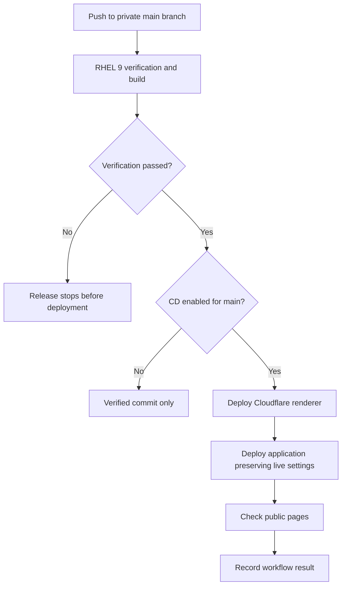

# CI/CD walkthrough

Talember uses GitHub Actions for continuous integration and production deployment.
The production workflow runs on a private RHEL 9 host; the open-source workflow
runs on GitHub-hosted runners. This document describes the production design
without publishing its credentials or environment-specific deployment scripts.

## Release path

A post-deployment check can fail after a deployment has occurred. A failed workflow
does not imply the old version is still running. Automatic rollback is not claimed.
Public-page checks establish availability, not a successful paid video journey.

## Tools and responsibilities

| Tool | What it does |
| --- | --- |
| Git and GitHub | Versioned source, review and commit-to-run traceability |
| GitHub Actions | Orders verification and deployment jobs; records their results |
| Self-hosted RHEL 9 runner | Executes private release verification and deployment |
| Node.js and TypeScript | Application type checking, linting, tests and builds |
| Docker and Python | Tests the video compositor in a container |
| Wrangler and Cloudflare | Deploy the application and renderer |
| Ansible | Configures the operations host; registered-runner management is opt-in |
| Go monitoring probe | Reports public-page health and Prometheus-compatible metrics |

RHEL is outside the customer request path. A runner outage prevents releases and
can affect monitoring from that host; it does not itself stop the Cloudflare app.
Ansible configures infrastructure; GitHub Actions coordinates software releases.

## Public CI you can inspect

The executable [workflow](../.github/workflows/ci.yml) contains three jobs:

- **Application:** type checking, linting, service tests, build, fresh local database
  migrations and publication audit.
- **Renderer:** container build and Python compositor tests with networking disabled
  during the test run.
- **Operations:** Go race tests, Python tests and Ansible syntax validation.

Public pull requests have no access to the production runner or deployment
credentials. There is no active public CD workflow. A fork can adopt the architecture
using its own isolated release environment and provider accounts.

## Reproduce and understand it

1. Run the checks in [development](DEVELOPMENT.md) locally. Explain which failure
   each check detects before reading a successful CI run.
2. Open a public Actions run and match its commit to its three jobs. Compare the
   workflow configuration with the recorded steps.
3. In a disposable private lab repository, configure an isolated runner. Practice
   a test-only workflow before giving it any deployment access.
4. Follow [deployment](DEPLOYMENT.md) for your own disabled/sandbox instance. Keep
   deployment behind successful verification and limit credentials to that instance.
5. Introduce a failing test on a lab branch. Confirm it prevents deployment, then
   fix it and explain the dependency between the jobs.
6. Practice diagnosing a failed post-deployment check. Inspect the actual deployed
   version before deciding whether a corrective release is necessary.

Do not connect a persistent production runner to untrusted public pull requests.
Migrations, payment operations and paid model calls are not implicit test steps.
These exercises do not require live customer data or real purchases.
